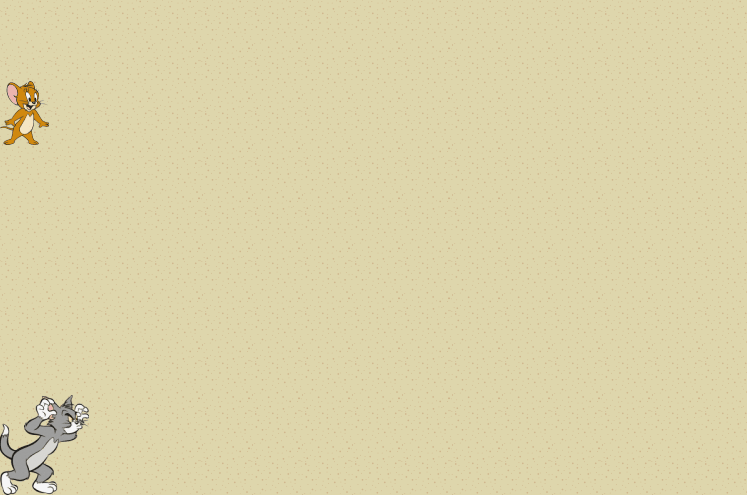

# Tom y Jerry

Estamos armando un juego en el que tenemos a Tom, el gato, que se la pasa persiguiendo a Jerry, un ratón.

Sabemos que Tom tiene una cantidad de energía que varía a lo largo del juego, dependiendo de sus actividades de comer ratones y de correr. También será relevante la velocidad a la que son capaces de correr Tom y Jerry.

Ya disponemos de una implementación para Jerry, y algunas ideas de lo que necesitaremos implementar para Tom en el archivo `tomYJerry.wlk`. A continuación se describen los requerimientos para completar su definición.

## Parte 1 (Acá no es necesario Wollok Game)

Necesitamos implementar la siguiente lógica para Tom:
- La velocidad de Tom es 5 metros x segundo + (energia medida en joules / 10). 
- Cuando Tom come un ratón, su energía aumenta en 12 joules + el peso del ratón. 
- Cuando Tom corre durante una cantidad de segundos indicada, su energía disminuye en (0.5 x cantidad de metros que corrió).

> Observar que la cuenta para el consumo de energía al correr está en joules consumidos por metro, pero cuando me dicen cuánto corrió, es en segundos. La velocidad a considerar para saber cuántos metros corre en esa cantidad de segundos es la que tiene Tom antes de empezar a correr, no varía durante una carrera.

### ¿Que podríamos probar?

- La velocidad de Tom depende de su energía. Por ejemplo, si tiene 20 joules de energía, su velocidad debería ser 7.
- Cuando Tom come un ratón, su energía aumenta en relación al peso del ratón comido.
- Cuando Tom corre una cantidad de segundos, pierde energía. Debería perder más energía cuando corre rápido que cuando corre lento.

## Parte 2

Necesitamos poder determinar si a Tom le conviene correr a un ratón que se encuentra a una distancia indicada (en metros). Esto será cierto si Tom es más veloz que el ratón, y además la energía que gana por comer al ratón es mayor a la que consume corriendo esa distancia.

### ¿Que podríamos probar?

Debemos validar que:
- A Tom le conviene correr a un ratón que le aporta más energía de la que perdería por correrlo
- A Tom no le conviene correr a un ratón que le aporta menos energía de la que perdería corriéndolo
- A Tom no le conviene correr a un ratón que es más veloz que él, independientemente de la distancia a la que se encuentre

## Para pensar

- ¿Tom es capaz de trabajar con otros ratones con la implementación actual?
- ¿Qué hace falta cumplir para ser considerado un ratón?

---------

## Wollok Game

Disponemos de una interfaz gráfica para "jugar al juego" que está incompleta.

El juego debería funcionar así:
- Si Tom consigue atrapar a Jerry se lo come siguiendo la lógica definida en la **parte 1** del ejercicio, y luego Jerry revivirá más veloz algunas veces, hasta que deja de aparecer cuando ya alcanzó cierta velocidad.

Con las flechas se puede mover a Tom de a un casillero sin que eso impacte a su energía. 

Y además:
- Usando la **tecla espacio** se le indica a Tom que corra a Jerry (usando la lógica de la **parte 1**)
- Usando la **tecla i** Tom nos dice si le conviene correr a Jerry (usando la lógica de la **parte 2**)
- Usando la **tecla s** hacemos aparecer a otro ratón!

> Para correr el juego, seleccioná el archivo `game/tomYJerryGame.wpgm` y correlo con la opción `Run As -> Wollok Program`.

Ahora, mucho de esto esta incompleto, así que hay varios TODOs para implementar ;)

Estan en el código, pero los repetimos acá:
- **hacer que tomVisual pueda usar a tom**, hay un objeto que debería mostrar a tom en pantalla y que delega bastante comportamiento en el tom que implementamos en las partes 1 y 2, necesitamos que este tomVisual pueda usar a tom para que cuando ocurran acciones que involucren a tom (como colisionar con Jerry) pase lo que queremos.
- **hacer que cuando tomVisual atrape al raton, se lo coma y le mande al raton que fue atrapado**, es decir, que modifique su energía según la lógica de comerse el ratón, y que el ratón que se comió reciba el mensaje de que fue atrapado así puede hacer algo al respecto (revisar que mensajes entiende el raton que está en el mismo archivo).
- **hacer que tomVisual se mueva hasta la posición donde estaba su perseguido tras hacer una corrida**
- **hacer que cuando apretemos i tom nos diga si le conviene perseguir a jerry**, tomVisual ya sabe contestarlo, pero queremos que nos lo diga cuando apretamos i!
- **Agregar a speedy gonzalez, y hacer que aparezca al apretar S**, en el código dice que cosas debería cumplir.
